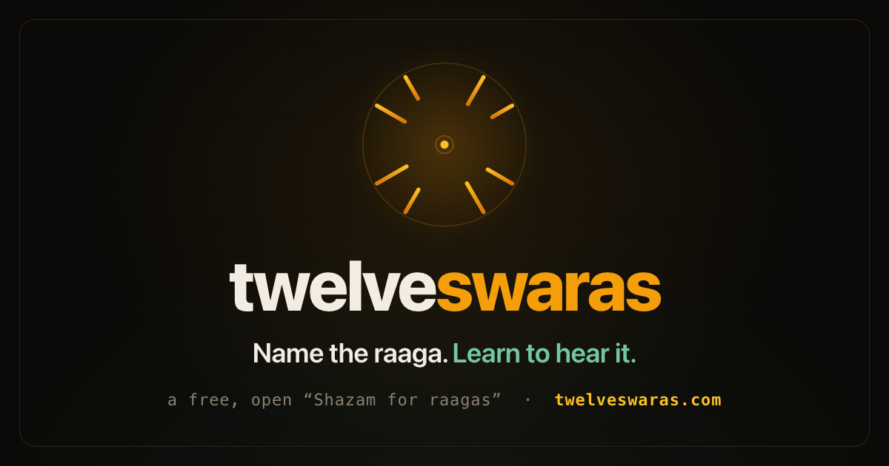
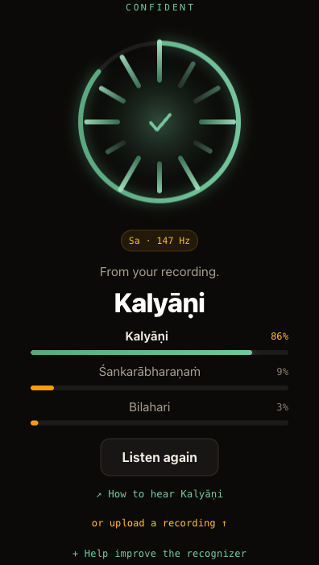

<p align="center"></p>

# twelveswaras

[](LICENSE)
[](https://twelveswaras.com)

An open-source "Shazam for raagas": play it a clip of Carnatic music and it identifies the
**raaga**, shows the top-3 with honest confidence and the tonic (Sa) it found, and helps you
learn to hear that raaga. Paired with a community-contributed, openly-licensed **data commons**
(now live) so the model improves over time.

**Live:** [twelveswaras.com](https://twelveswaras.com) · recognizer on a
[Hugging Face Space](https://huggingface.co/spaces/twelveswaras/twelveswaras)

> **Status:** live and recognizing 40 Carnatic raagas. The opt-in **contribute-to-the-commons**
> loop is now live (identify then donate, or contribute a recording directly).
> **Focus:** Carnatic first; the name, schema, and pipeline are **tradition-neutral** by
> design, with Hindustani planned as a fast-follow.
> **Scope:** Non-commercial, open-source only. A public good stewarded in the neutral
> [`twelveswaras`](https://github.com/twelveswaras) GitHub + HF org, not owned by any company.

<p align="center"></p>

## Why "twelveswaras"?

The twelve swaras are the twelve note-positions of the octave, the shared alphabet of **both**
Carnatic and Hindustani music. The name is tradition-neutral on purpose: Carnatic is where we
start, but nothing in the name, schema, or pipeline locks us to one tradition.

## Why this is different from Shazam

Shazam does audio *fingerprinting*: it matches a specific recording. twelveswaras does audio
*classification*: it infers the musical structure (the raaga) of **any** performance, including
one it has never heard. That's a Music Information Retrieval problem, not a lookup.

## How it works

Fully automatic, no user input beyond the audio (see [`METHODOLOGY.md`](METHODOLOGY.md) for the
full detail and citations):

1. **Predominant-melody pitch** from the audio (essentia `PredominantPitchMelodia`).
2. **Tonic (Sa)** from the tanpura drone (compiam / essentia, the Salamon–Gulati–Serra
   multipitch method). *Tonic-normalization, heard relative to Sa, is the key unlock the
   Harvard reference thesis skipped.*
3. **Feature:** a tonic-normalized, windowed **Time-Delayed Melody Surface (TDMS)**, a 2-D
   histogram of `(pitch(t), pitch(t+delay))` that captures **gamaka** (the *movement* between
   notes), not just which notes occur.
4. **Classifier:** XGBoost over the surfaces, window-aggregated, with **temperature-calibrated**
   confidences (a shown "70%" is right ~70% of the time).

**Accuracy (cross-validated on the frozen 129-track benchmark, 40 raagas):** top-1 **0.806**,
top-3 **0.946** (~32× / 13× chance), after a junk gate that drops non-melodic windows (percussion,
speech, silence). That figure is on studio recordings; **accuracy in the wild is lower**, which is
exactly what the data commons exists to close. Full progression in
[`benchmark/leaderboard.md`](benchmark/leaderboard.md). Needs a drone: concert/TV audio works;
solo voice with no drone is unreliable.

## Data & attribution

Trained on openly-available research corpora, **attribution required by their licenses**:

- **Saraga Carnatic** (CompMusic / MTG-UPF): CC-BY-**NC-SA**. Predominant pitch + tonic annotations.
- **Indian Art Music Raga Recognition Dataset: Carnatic Music Dataset (CMD)** (CompMusic /
  MTG-UPF; Gulati et al.): CC-BY-**NC-ND** 3.0, [Zenodo](https://doi.org/10.5281/zenodo.7278510),
  accessed via `mirdata` (`compmusic_raga`). Its paired **Hindustani dataset (HMD)** is the
  training data for the planned Hindustani fast-follow.

Built with **essentia** and **compiam** (both **AGPL**; the deployed Space carries AGPL
obligations, satisfied by publishing all source), plus librosa, xgboost, and gradio.

## Prior work we build on

- **S. Gulati et al.**, *Time-Delayed Melody Surfaces for Rāga Recognition* (ISMIR 2016): the
  TDMS feature at the heart of our model.
- **S. Gulati**, *Computational Approaches for Melodic Description in Indian Art Music Corpora*
  (PhD thesis, UPF 2016): the definitive reference; tonic + melody methods.
- **H. Narayanan**, *Classifying Ragams in Carnatic Music with Machine Learning* (Harvard, 2024),
  the "Shazam for ragas" reference implementation; we improve on it with tonic-normalization
  and TDMS, and adopt its data-augmentation idea (see METHODOLOGY.md).
- **Madhusudhan & Beigi**, *DEEPSRGM*: sequence-model benchmark target.

Full bibliography in [`METHODOLOGY.md`](METHODOLOGY.md).

## Roadmap

**Shipped:**

- **v0 to v0.5:** identify-only, then legible, calibrated recognition with gamaka features and a junk gate.
- **Raaga Explorer:** a browsable reference for all 40 raagas grouped by melakarta, an ear-trainer, and open data at `/data/raagas.json` (facts are draft, pending expert review).
- **v1 commons:** the opt-in contribute-to-the-commons loop, rights-gated and quarantined, audio private unless released CC-BY.
- **Abstention:** below a confidence threshold it says "not sure" and invites you to teach it the raaga.

**Next:**

- **Deepen the commons before widening it.** The highest-value contribution is more in-the-wild
  audio of the *current* 40 raagas; raagas beyond the 40 are pooled and trained in only once one
  reaches critical mass, always quarantined from the 40 (an unknown raaga can never be model-confirmed).
- **Verify and publish.** Community verification of pending clips, the consolidation job, and the
  public CC-BY contributor dataset.
- **Quality (v2).** TDMS to CNN, allied-raaga disambiguation, an out-of-distribution detector for
  the confident-but-wrong cases, an expert-annotation tier, and Hindustani.

## Getting started (developers)

The project uses **two conda environments** (the audio-to-pitch path needs `numpy < 2`,
training uses `numpy 2.x`, so they are kept separate):

```bash
# 1. Training + features + benchmark + most tests
conda env create -f environment.yml
conda activate twelveswaras

# 2. Inference + demo (essentia pitch + compiam tonic, the audio -> raaga path)
conda env create -f environment-inference.yml
conda activate twelveswaras-infer
python -m apps.identify
```

On Linux (for example the Hugging Face Space) install from `requirements.txt` instead of
`environment.yml`. Run the tests from the `twelveswaras` env at the repo root:

```bash
pytest tests/
```

Top-level layout: `raaga_id/` (core library: pitch, TDMS features, model, training,
evaluation), `apps/` (identify / contribute / verify entry points), `space/` (the Hugging
Face Space), `cloudflare/` (the Worker API, D1 schema, Pages), `site/` (the website),
`tools/` (dev + data scripts), `pipeline/` (consolidate + retrain jobs), and `benchmark/`
(the frozen evaluation set + leaderboard).

## Contributing

Contributions are very welcome. For most people the single most valuable one is not code:
**contribute an audio clip** at [twelveswaras.com](https://twelveswaras.com) after
identifying a raaga, which grows the openly-licensed data commons and improves the model.
Carnatic musicians can also review the raaga reference, and everyone can report issues or
send code.

See [`CONTRIBUTING.md`](CONTRIBUTING.md) for details and
[`CODE_OF_CONDUCT.md`](CODE_OF_CONDUCT.md) for community standards. Code contributions are
under MIT; data contributions under CC-BY-4.0. Security reports go to the private channel
in [`SECURITY.md`](SECURITY.md), not a public issue.

## Citing this work

If you use twelveswaras in your research, please cite it. Machine-readable metadata is in
[`CITATION.cff`](CITATION.cff) (GitHub renders a "Cite this repository" button from it),
which also lists the key prior work the model builds on.

## Licensing

- **Code:** MIT.
- **Contributor dataset (the commons):** CC-BY-4.0, kept **separate** from non-commercial source
  data so it stays cleanly reusable.
- **Seed model:** trained on Saraga (CC-BY-**NC-SA**), so the seed weights carry CC-BY-NC-SA; a
  later model retrained purely on the contributor commons can be clean CC-BY.

This is a non-commercial, open-source public good. See [`GOVERNANCE.md`](GOVERNANCE.md) for
stewardship and [`METHODOLOGY.md`](METHODOLOGY.md) for the full method + references.
